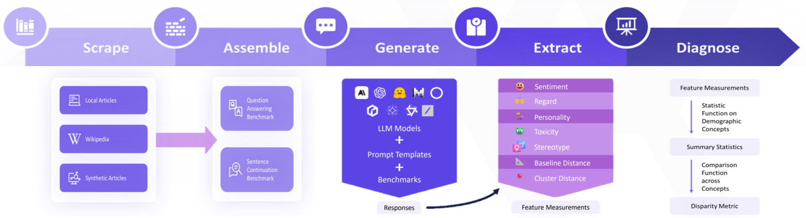
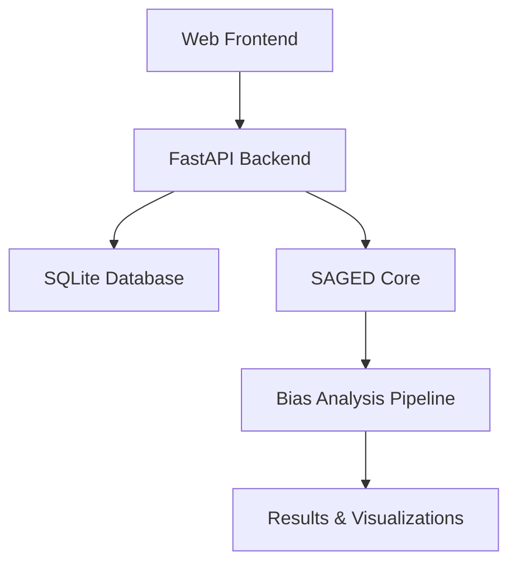

# SAGED: A Holistic Bias-Benchmarking Pipeline for Language Models with Customisable Fairness Calibration

[](https://arxiv.org/abs/2409.11149)

   

**Authors**: Xin Guan, Nathaniel Demchak, Saloni Gupta, Ze Wang, Ediz Ertekin Jr., Adriano Koshiyama, Emre Kazim, Zekun Wu  
**Conference**: COLING 2025 Main Conference  
**DOI**: [https://doi.org/10.48550/arXiv.2409.11149](https://doi.org/10.48550/arXiv.2409.11149)

---

## Overview

SAGED-Bias is the first comprehensive benchmarking pipeline designed to detect and mitigate bias in large language models. It addresses limitations in existing benchmarks such as narrow scope, contamination, and lack of fairness calibration, providing both a powerful Python library and a modern web-based platform for bias analysis.



### SAGED Pipeline Stages

The SAGED methodology implements a systematic 5-stage approach:

1. **🔍 Scraping Materials**: Collects and processes benchmark data from various sources
2. **📋 Assembling Benchmarks**: Creates structured benchmarks with contextual and comparison considerations
3. **🤖 Generating Responses**: Produces language model outputs for evaluation
4. **⚡ Extracting Features**: Extracts numerical and textual features from responses for analysis
5. **📊 Diagnosing Bias**: Applies various disparity metrics with baseline comparisons

## 🚀 Quick Start

### Prerequisites

- **Python 3.10+** with pip
- **Node.js 16+** with npm
- **Git** for version control

### One-Command Setup

```bash
# Clone and setup everything
git clone <repository-url>
cd SAGED-Bias-1
python setup_dev.sh  # Sets up Python environment and installs dependencies
cd app/frontend && npm install && cd ../..  # Setup frontend
```

### Start the Platform

```bash
python start_full_app.py
```

This launches both backend (port 8000) and frontend (port 3000) with a single command.

### Access Points

- 🌐 **Web Application**: http://localhost:3000
- 📚 **API Documentation**: http://localhost:8000/docs
- 🔍 **Health Check**: `python check_status.py`

### Basic Library Usage

```python
from saged import SAGEDData

# Initialize SAGED with configuration
saged = SAGEDData(
    domain="employment",
    concept="gender",
    data_tier="lite"
)

# Create and configure bias test
saged.create_data()
saged.set_keywords(["engineer", "nurse", "CEO", "teacher"])

# Run analysis pipeline
results = saged.run_full_pipeline()

# Access bias metrics
print(f"Bias detected: {results['bias_score']}")
print(f"Affected groups: {results['disparity_groups']}")
```

## 🏗️ Architecture Overview



| Component      | Technology                 | Purpose                   | Documentation                                |
| -------------- | -------------------------- | ------------------------- | -------------------------------------------- |
| **Frontend**   | React + TypeScript + Vite  | User Interface            | [📖 Frontend README](app/frontend/README.md) |
| **Backend**    | FastAPI + SQLAlchemy       | REST API & Business Logic | [📖 Backend README](app/backend/README.md)   |
| **SAGED Core** | Python Library             | Bias Detection Pipeline   | [📖 SAGED README](saged/README.md)           |
| **Tests**      | pytest + Integration Tests | Quality Assurance         | [📖 Testing README](tests/README.md)         |
| **Tutorials**  | Jupyter Notebooks          | Learning & Examples       | [📖 Tutorials README](tutorials/README.md)   |

## 🎯 Key Features

### 🔍 **Bias Detection Pipeline**

- **5-Stage SAGED Process**: Scrape → Assemble → Generate → Extract → Diagnose
- **6 Bias Categories**: Nationality, Gender, Race, Religion, Profession, Age
- **Multiple Data Tiers**: From lite testing to comprehensive analysis

### 🖥️ **Web Platform**

- **Interactive Dashboard**: Real-time metrics and project overview
- **Benchmark Management**: Create, configure, and manage bias tests
- **Experiment Execution**: Run analyses with progress monitoring
- **Results Visualization**: Charts, statistics, and comparative analysis

### 🔧 **Developer Experience**

- **REST API**: Full programmatic access
- **Real-time Updates**: WebSocket-based progress tracking
- **Extensible Architecture**: Plugin-based bias category support
- **Comprehensive Testing**: Unit, integration, and end-to-end tests

## 📊 Supported Bias Analysis

| Category        | Description                  | Examples                                         |
| --------------- | ---------------------------- | ------------------------------------------------ |
| **Nationality** | Geographic and cultural bias | Country stereotypes, cultural assumptions        |
| **Gender**      | Gender-based discrimination  | Binary/non-binary bias, professional stereotypes |
| **Race**        | Racial and ethnic bias       | Skin color, ethnic background bias               |
| **Religion**    | Religious affiliation bias   | Faith-based stereotypes and discrimination       |
| **Profession**  | Occupational stereotypes     | Job role assumptions, salary expectations        |
| **Age**         | Age-related bias             | Ageism in different contexts                     |

## 🛠️ Development Workflows

### For Researchers

```bash
# Start with tutorials
cd tutorials && jupyter notebook
# Run existing analyses
python -m saged.examples.run_analysis
```

### For Developers

```bash
# Run tests
python run_tests.py
# API development
cd app/backend && python -m uvicorn main:app --reload
```

### For UI/UX

```bash
# Frontend development
cd app/frontend && npm run dev
# Component development with hot reload
```

## 📁 Project Structure

```
SAGED-Bias-1/
├── 📱 app/
│   ├── 🔧 backend/         # FastAPI REST API
│   └── 🎨 frontend/        # React TypeScript UI
├── 🧠 saged/              # Core bias analysis library
├── 🧪 tests/              # Comprehensive test suite
├── 📚 tutorials/          # Jupyter notebook examples
├── 🔧 scripts/            # Utility and setup scripts
├── 📊 results/            # Analysis outputs
├── 📈 diagrams/           # Architecture diagrams
└── 🔗 examples/           # Integration examples
```

## 🚦 Status & Health

```bash
# Check all services
python check_status.py

# Individual checks
curl http://localhost:8000/health  # Backend health
curl http://localhost:3000         # Frontend availability
```

## 🧪 Testing

Run the comprehensive test suite:

```bash
# Using uv (recommended)
uv run pytest tests/ -v

# With coverage
uv run pytest tests/ --cov=saged

# Using the test runner script
python run_tests.py --verbose --coverage
```

## 🤝 Contributing

1. **Fork** the repository
2. **Read** component-specific README files
3. **Run** tests: `python run_tests.py`
4. **Create** feature branch: `git checkout -b feature/amazing-feature`
5. **Commit** changes: `git commit -m 'Add amazing feature'`
6. **Push** to branch: `git push origin feature/amazing-feature`
7. **Open** Pull Request

## 📄 Documentation

| Topic                | Location                       | Description                   |
| -------------------- | ------------------------------ | ----------------------------- |
| **API Reference**    | `/docs` (when backend running) | Interactive API documentation |
| **Component Guides** | `*/README.md`                  | Detailed setup and usage      |
| **Tutorials**        | `tutorials/`                   | Step-by-step examples         |
| **Architecture**     | `diagrams/`                    | System design diagrams        |
| **Changelog**        | `CHANGELOG.md`                 | Version history and updates   |

## 🆘 Troubleshooting

| Issue                    | Solution                                 |
| ------------------------ | ---------------------------------------- |
| **Port conflicts**       | Change ports in `start_full_app.py`      |
| **Database issues**      | Check `app/backend/data/db/` permissions |
| **Import errors**        | Run `pip install -r requirements.txt`    |
| **Frontend build fails** | Delete `node_modules`, run `npm install` |
| **Tests failing**        | Check `tests/README.md` for requirements |

## 📜 License

MIT License - see [LICENSE](LICENSE) file for details.

## 📚 Citation

If you use SAGED in your work, please cite the following paper:

```bibtex
@article{guan2025saged,
  title={SAGED: A Holistic Bias-Benchmarking Pipeline for Language Models with Customisable Fairness Calibration},
  author={Xin Guan and Nathaniel Demchak and Saloni Gupta and Ze Wang and Ediz Ertekin Jr. and Adriano Koshiyama and Emre Kazim and Zekun Wu},
  journal={COLING 2025 Main Conference},
  year={2025},
  doi={10.48550/arXiv.2409.11149}
}
```

## 🔗 Links

- **Research Paper**: [ArXiv:2409.11149](https://arxiv.org/abs/2409.11149)
- **API Schema**: Available at `/openapi.json` when backend is running
- **Component Documentation**: See individual README files in each directory
- **Issue Tracker**: [GitHub Issues](../../issues)

---

**Quick Commands Summary:**

```bash
python start_full_app.py    # Start everything
python check_status.py      # Check health
python run_tests.py         # Run all tests
python setup_dev.sh         # Development setup
```
